# Trade Simulator

Simulador de inversiones en bolsa con datos reales para practicar trading y gestión financiera.

---

## 📌 Descripción

Trade Simulator es una plataforma web que permite simular inversiones en tiempo real con precios del mercado reales. Ideal para aprender a gestionar portafolios, realizar operaciones, y analizar resultados sin riesgo financiero.

---

## 🖥️ Capturas de pantalla por sección

### Dashboard / Inicio

El **Dashboard** es la página principal donde el usuario ve un resumen general de su portafolio, estado de sus inversiones y alertas importantes.  
Aquí se muestra el rendimiento actual, noticias relevantes y accesos rápidos a las funciones principales.

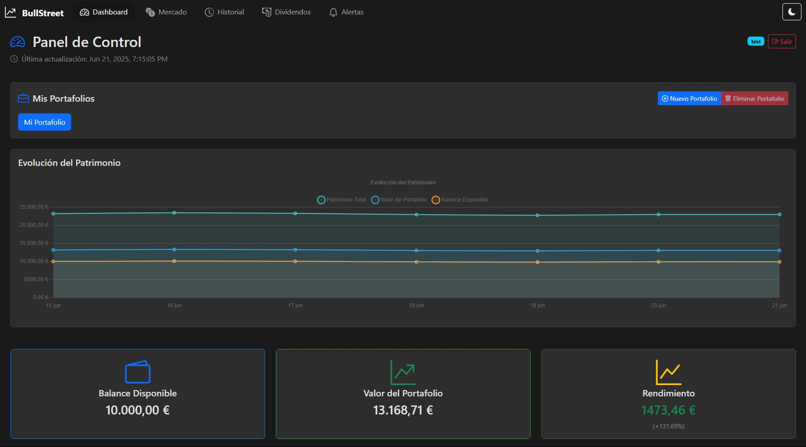  
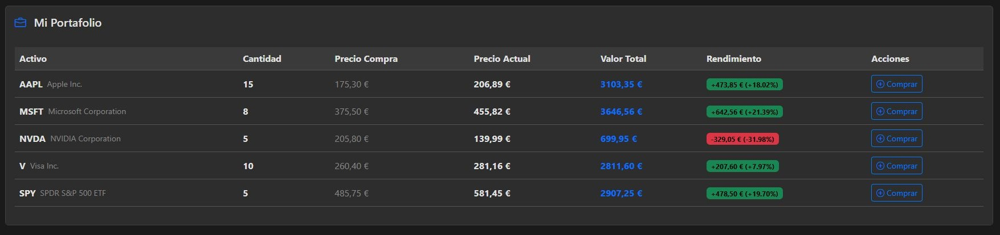  

---

### Mercado de activos

En esta sección, el usuario puede consultar el mercado completo, con todos los activos disponibles para invertir. Se muestran cotizaciones, volúmenes y tendencias para facilitar la toma de decisiones.

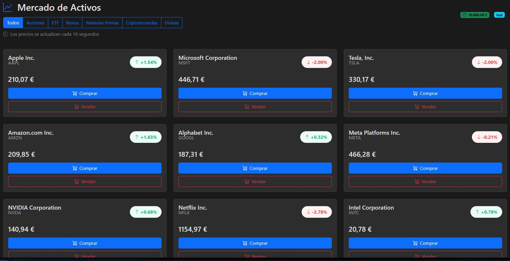  

---

### Página de un activo

Cada activo dispone de una página dedicada con información detallada, gráficos históricos, noticias y opciones para comprar o vender.  
Estas dos capturas muestran diferentes vistas y funcionalidades dentro de la página del activo.

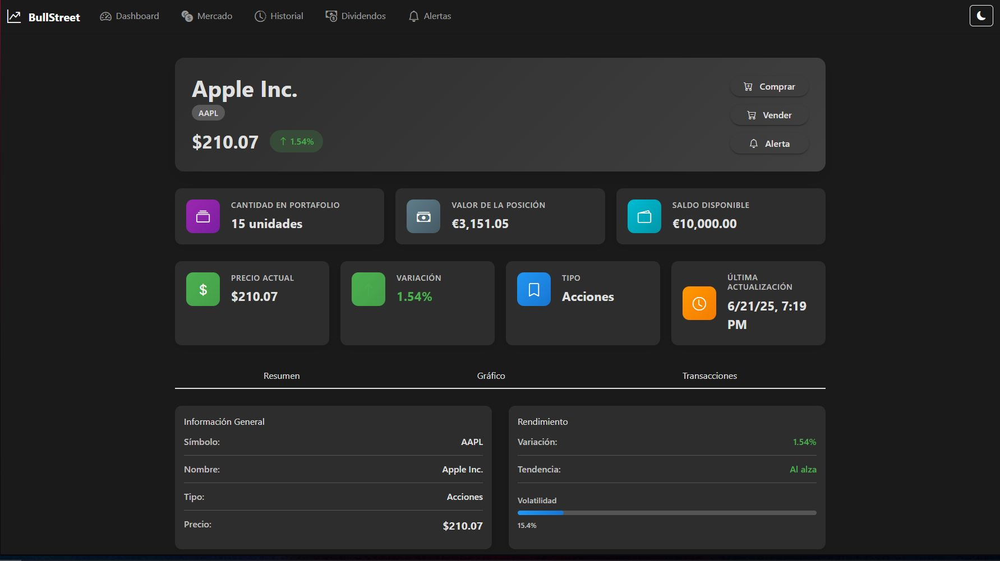  
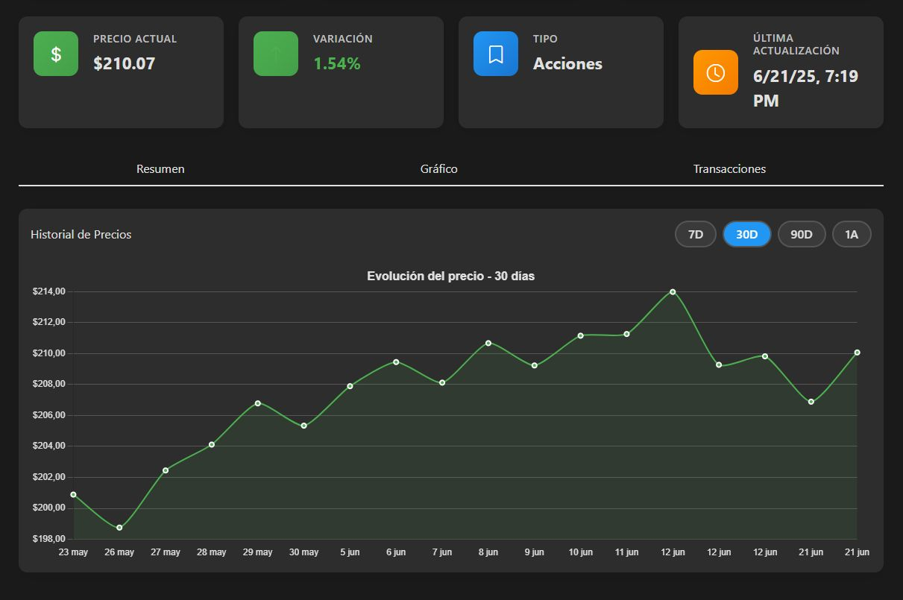  

---

### Historial de transacciones

Esta pantalla presenta el historial completo de operaciones realizadas por el usuario, con detalles de fechas, cantidades, precios y resultados, permitiendo analizar la evolución de su portafolio.

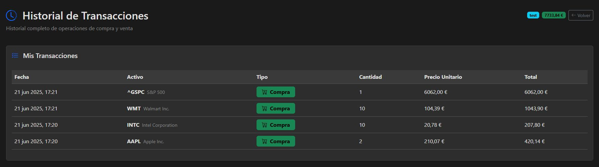  

---

### Página de pago de dividendos

Aquí el usuario puede consultar y gestionar el pago de dividendos recibidos por sus activos, con resumen de montos y fechas.

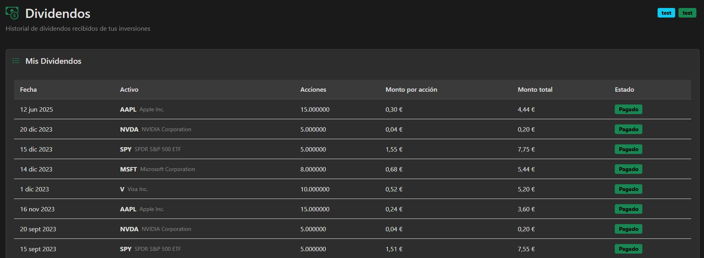  

---

### Gestión de alertas (stop loss y otras)

Permite configurar alertas automáticas para proteger inversiones, como stop loss y otras condiciones personalizadas.  
Estas dos capturas muestran las opciones disponibles y la interfaz para crear o modificar alertas.

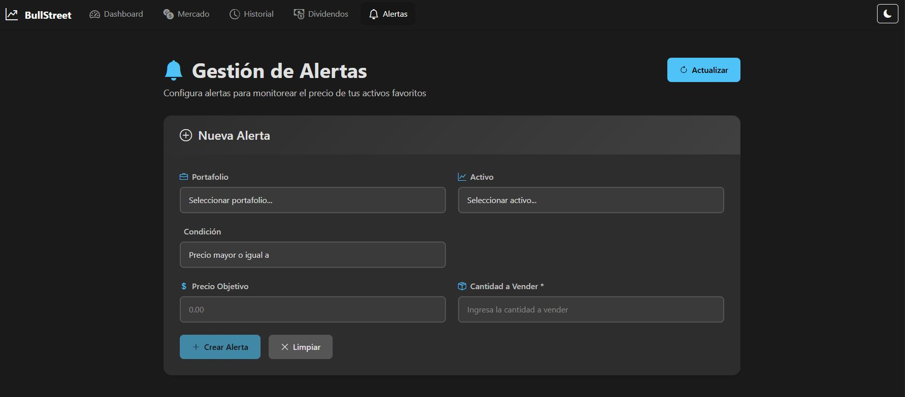  
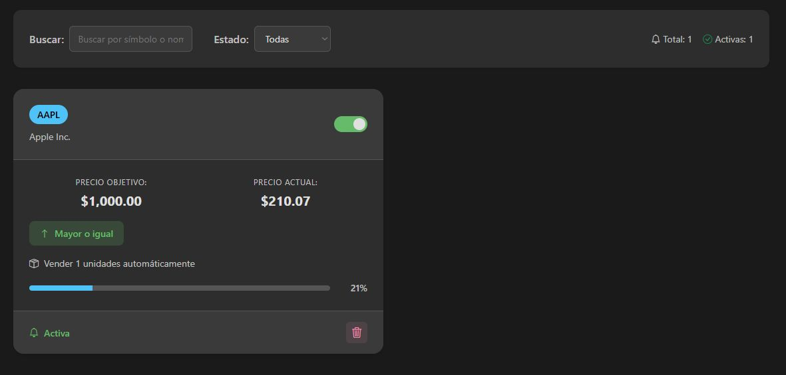  

---

### Panel de administración

El panel de administración es la herramienta para que los administradores gestionen la plataforma, revisen estadísticas generales y controlen la actividad del sistema.

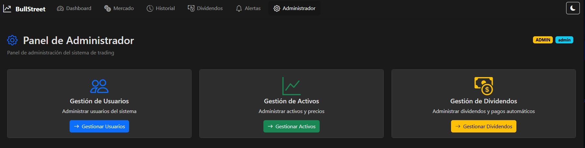  

---

### Gestión de usuarios (admin)

Desde esta sección, los administradores pueden gestionar los usuarios registrados, con opciones para modificar permisos, activar o desactivar cuentas.

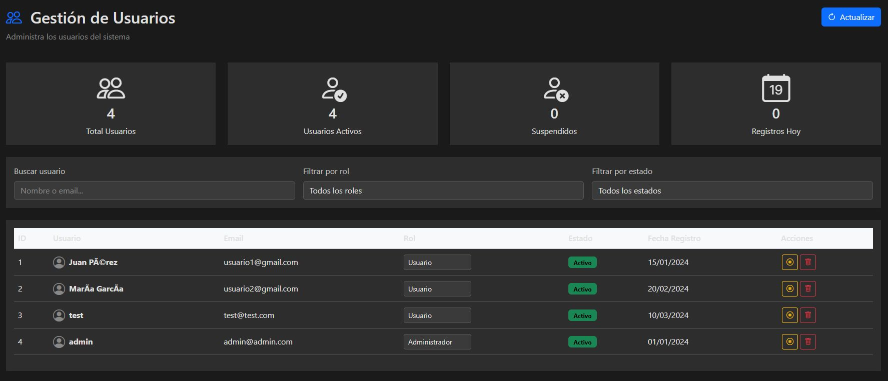  

---

### Gestión de activos (admin)

Los administradores pueden añadir, modificar o eliminar activos del mercado simulado, asegurando que la información esté actualizada y sea relevante.

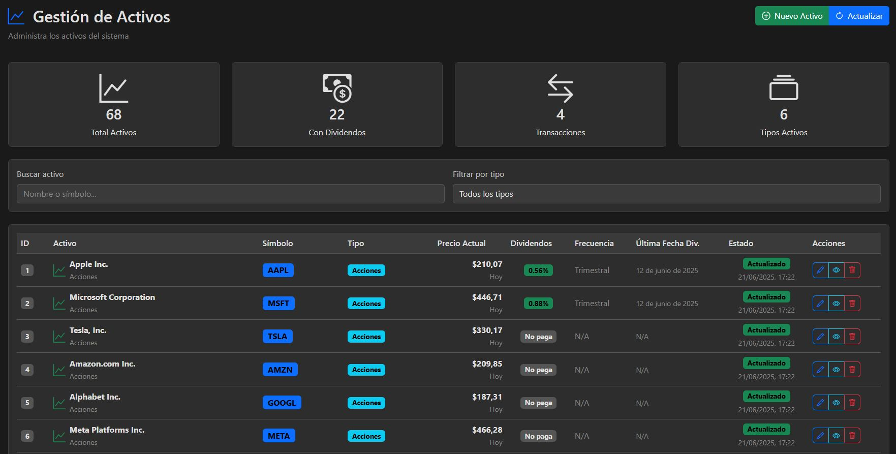  

---

### Gestión de dividendos (admin)

Aquí se gestionan los pagos de dividendos que corresponden a los activos, permitiendo actualizar la información y confirmar transacciones.

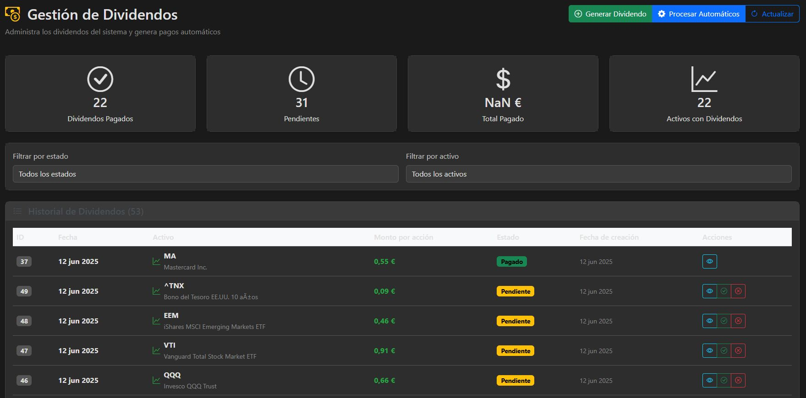  

---

## 🚀 Instalación y uso

Clona el repositorio, instala las dependencias y ejecuta la aplicación localmente:

```bash
git clone https://github.com/perichico/trade-simulator.git
cd trade-simulator
start.docker.bat / ./start.docker.sh
```

---

## 🛠️ Tecnologías usadas

- Node.js y Express para el backend  
- MySQL como base de datos  
- Angular

---

## 🙌 Contribuciones

Las contribuciones son bienvenidas. Para aportar:

1. Haz fork del repositorio.  
2. Crea una rama nueva para tu feature o fix.  
3. Realiza commits claros y descriptivos.  
4. Envía un Pull Request explicando tus cambios.


---

## 🤝 Contacto

Si tienes dudas, sugerencias o quieres colaborar, contáctame en [perifedea000@gmail.com] o abre un issue en GitHub.

---

¡Gracias por visitar Trade Simulator! 🚀
